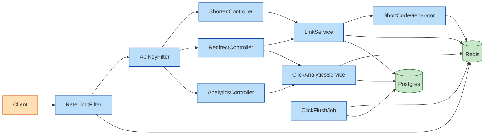
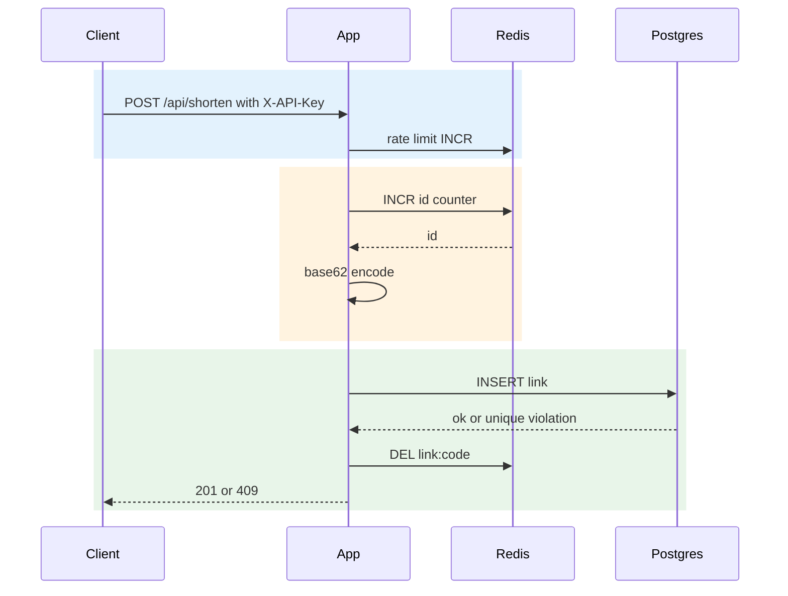
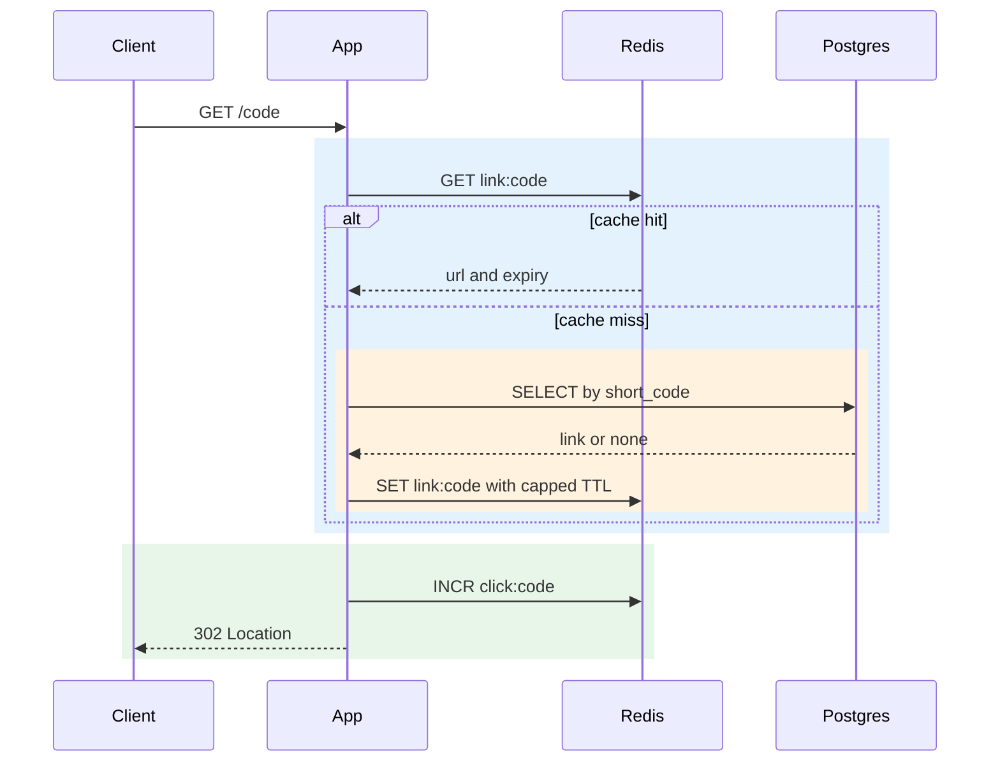
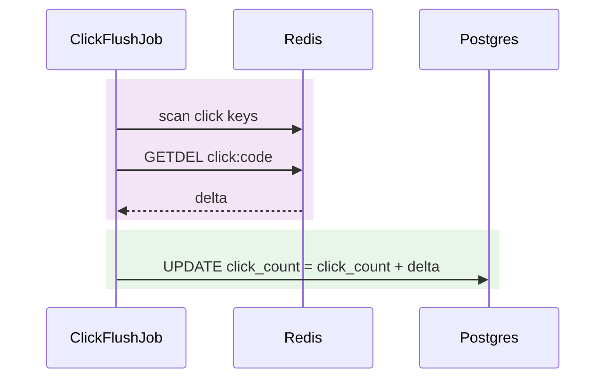

# 🔗 URL Shortener: Design Document

## 🎯 Overview

**Problem.** Build a Java 21 / Spring Boot service that (1) shortens long http/https URLs, (2) redirects short codes to the original URL, and (3) reports click analytics per code. The requirement gives no firm scale, so v1 is a single-region service. Postgres is the source of truth and Redis provides the cache, counters, and rate limiting.

**Goals**
- `POST /api/shorten` returns a unique base62 code and short URL (optional custom alias, optional TTL).
- `GET /{shortCode}` returns a 302 with low latency (target p95 < 50 ms, 200 rps per instance).
- Click counting never blocks a redirect (eventual consistency, write-behind).
- Stateless app nodes, API-key auth on mutating endpoints, per-client rate limiting, RFC 7807 errors.
- Dockerised (app, Postgres, Redis), Flyway migrations, Actuator, OpenAPI, Testcontainers tests.

**Non-goals**
- User accounts, UI, QR codes, geo-IP, bot filtering, multi-region, phishing detection, billing.
- Link editing or deletion in v1 (cache eviction is designed for it).
- Time-series or referrer analytics: v1 stores only an aggregate `click_count`.

> ⚠️ **Risk:** The requirement text asks for daily buckets and top referrers. The decided design stores only `links.click_count`, so those are **not delivered in v1** (see open questions).

> 💡 **Note:** The decided API paths are `/api/shorten` and `/api/analytics/{shortCode}`. These differ from the paths in the requirement's acceptance criteria.

## 🏗️ Architecture

Components:
- **Filters**: `RateLimitFilter` (Redis fixed window) and `ApiKeyFilter` (constant-time `X-API-Key` check on mutating requests), wired by `SecurityConfig` as a stateless chain.
- **Controllers**: `ShortenController`, `RedirectController`, `AnalyticsController`.
- **Services**: `LinkService` (create, cache-aside resolve, evict), `ShortCodeGenerator` (Redis INCR then base62), `ClickAnalyticsService` (Redis click counters), `ClickFlushJob` (scheduled write-behind).
- **Persistence**: `LinkRepository` (Spring Data JPA), `Link` entity.
- **Errors**: `GlobalExceptionHandler` maps `LinkNotFoundException` (404), `LinkExpiredException` (410), and `AliasConflictException` (409) to ProblemDetail.

**Request flow.** Every request passes the rate limiter. Mutating requests also pass the API-key check. Controllers delegate to services, which use Redis first and Postgres as the source of truth.

## 🗄️ Data model

**Table `links`** (Flyway V1 `create_links`)

| Column | Type | Notes |
|---|---|---|
| id | BIGINT PK | assigned from the Redis counter, not generated by the DB |
| short_code | VARCHAR(32) NOT NULL | unique (`uq_links_short_code`) |
| original_url | VARCHAR(2048) NOT NULL | |
| created_at | TIMESTAMPTZ NOT NULL | default `now()` |
| expires_at | TIMESTAMPTZ | nullable |
| click_count | BIGINT NOT NULL | default 0, flushed deltas |

**Indexes**
- `uq_links_short_code` (unique) serves redirect lookups and alias conflict detection.
- `idx_links_expires_at` is a partial index `WHERE expires_at IS NOT NULL`.

**Redis keys**

| Key | Purpose | TTL |
|---|---|---|
| `id:counter` (name illustrative) | atomic INCR for IDs; AOF-persisted | none |
| `link:{code}` | cached mapping (URL and expiry) | min(redirect-ttl, remaining lifetime) |
| `click:{code}` | pending click delta | consumed by GETDEL |
| rate-limit counter per client IP | INCR + EXPIRE window | window length |

> 💡 **Note:** At startup the counter is seeded to `max(id)` from Postgres.

## 🌐 API design

| Method and path | Auth | Success | Errors |
|---|---|---|---|
| POST `/api/shorten` | X-API-Key | 201 ShortenResponse | 400, 401, 409, 429, 503 (Redis down) |
| GET `/{shortCode}` | none | 302 + Location | 400, 404, 410, 429 |
| GET `/api/analytics/{shortCode}` | none in v1 | 200 AnalyticsResponse | 400, 404, 410, 429 |

- `ShortenRequest`: `url` (required, max 2048), `customAlias` (`^[0-9A-Za-z_-]{3,32}$`), `ttlDays` (1–3650).
- `AnalyticsResponse`: `shortCode`, `originalUrl`, `totalClicks`, `createdAt`, `expiresAt`.
- Errors use `application/problem+json`.
- **OpenAPI spec:** `/v3/api-docs`. **Swagger UI:** `/swagger-ui/index.html`.

> ✅ **Decision:** The 401 responses on GET endpoints are documented only for deployments where a gateway enforces keys.

## 🔄 Key flows

1. **Shorten.**
   - Validate the request.
   - With an alias: use it, and a unique-constraint violation gives 409.
   - Without an alias: `ShortCodeGenerator` runs Redis INCR and encodes the result as base62.
   - TTL is `ttlDays` or the default of 30 days.
   - Insert into Postgres, evict `link:{code}`, return 201.
2. **Redirect.**
   - Read `link:{code}`. On a miss, load from Postgres and populate the cache with a capped TTL.
   - Expired links return 410, unknown codes return 404.
   - Otherwise INCR `click:{code}` (errors swallowed) and return 302.
3. **Analytics.** Return `click_count` from Postgres, plus pending Redis deltas.
4. **Flush.** Every 5 s, `ClickFlushJob` runs GETDEL on each `click:*` key and adds the delta with `incrementClickCount`.

## 📈 Sequence diagrams

**Shorten**

**Redirect, cache hit and miss**

**Analytics flush**

## ⚡ Caching and consistency

> ✅ **Decision:** The code-to-URL mapping is strongly consistent. Postgres is written before 201 is returned, and Redis is cache-aside only.

- Cache TTL is `min(redirect-ttl 3600 s, remaining lifetime)`, so a cached entry never outlives the link.
- Expiry is checked at resolve time, so correctness does not depend on cleanup.
- Any future update or delete must evict `link:{code}` after commit.
- Clicks are eventually consistent: Redis counters flushed every 5 s.
- If the flush fails after GETDEL, that delta is lost. This is accepted as best effort.

## 📊 Scalability and capacity

- App nodes are stateless, so scale-out only needs a load balancer.
- Redirects are mostly Redis reads, with Postgres as fallback. Target is 200 rps per instance.
- A single Redis is the shared dependency and a single point of failure for shorten.
- **Counter hot spot:** later, mitigate with block allocation of IDs per node.
- 7-character base62 gives about 3.5 trillion codes. Sequential IDs give shorter codes early on.
- Flush batching avoids per-click row contention in Postgres.

## 🔐 Security and rate limiting

- Mutating requests require `X-API-Key`. The key comes from the `SHORTENER_API_KEY` environment variable and is compared in constant time.
- GET endpoints are public in v1.
- Rate limit: 60 requests per minute per client IP (fixed window), returning 429 with `Retry-After`. It fails open if Redis is down.
- Forwarded headers are trusted only from the configured proxy.
- Only http/https URLs up to 2048 characters are accepted. Aliases must match the pattern.
- Client IP is not stored.

> ⚠️ **Risk:** Analytics are readable by anyone who knows the code.

## 🧯 Failure modes

| Failure | Behaviour |
|---|---|
| Redis down, redirect | 🟢 Served from Postgres; click recording skipped |
| Redis down, shorten | 🟡 503, since the counter is unavailable |
| Redis down, rate limiting | 🟡 Fail open |
| Postgres down | 🔴 Cache hits still redirect; misses and creates fail |
| App crash before flush | 🟡 Small click loss |
| Counter reset | 🔴 Duplicate IDs are rejected by the PK; retry, and seed from max(id) on startup |

## ⚠️ Risks

| Risk | Likelihood | Impact | Mitigation |
|---|---|---|---|
| Redis counter loss or reset causes duplicate IDs | 🟢 low | 🔴 high | AOF; seed to max(id); PK rejects duplicates with retry |
| Redis outage breaks shortening | 🟡 medium | 🟡 medium | 503 on shorten; redirects fall back to Postgres |
| Click loss on crash before flush | 🟡 medium | 🟢 low | Short flush interval; best-effort accepted |
| Stale cache after alias overwrite or delete | 🟢 low | 🟡 medium | Evict after commit; capped TTL |
| Rate limit bypass via spoofed X-Forwarded-For | 🟡 medium | 🟡 medium | Trust forwarded headers only from the configured proxy |
| Sequential codes are enumerable | 🔴 high | 🟢 low | Optional counter permutation or offset |
| API key leakage | 🟢 low | 🔴 high | Env-injected, constant-time compare, rotation |

## ⚖️ Trade-offs and open questions

| Choice | Benefit | Cost |
|---|---|---|
| Redis counter + base62 | No collisions, short codes | Redis dependency; sequential codes |
| Write-behind click counters | Redirect latency unaffected | Eventual consistency; possible small loss |
| Fixed-window rate limit | Simple and shared | Burst at window boundary |
| 302 redirects | Every click is counted | No browser caching, more load |
| Aggregate click_count only | Simple schema, cheap writes | No time-series or referrer analytics yet |

**Open questions**
1. Are daily buckets and top referrers required in v1? If so, a click-events table or rollup must be added, and this design would change.
2. Should the default 30-day TTL apply, given the original requirement said links never expire?
3. Should analytics require an API key?
4. Is Spring Boot 4 confirmed, given the requirement's assumptions mention 3.x?
